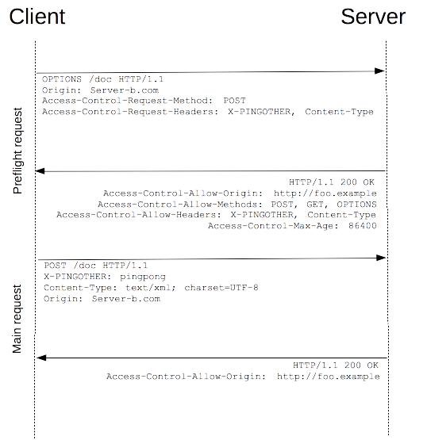

# HTTP 学習メモ
## HTTPとは
* HyperText Transfer Protocol
* クライアントサーバープロトコルであり、リクエストは受け取り側 (一般にはウェブブラウザー) が生成する。
* 扱う文書は、テキスト、レイアウトの定義、画像、動画、スクリプトなど、取り込まれたさまざまなサブ文書から再構成される。
* クライアント (通常はウェブブラウザー) が送信するメッセージをリクエスト、リクエストサーバーが回答として送信するメッセージをレスポンスと呼ぶ。
* TCP または TLS (暗号化された TCP 接続) を使用して送信されるアプリケーション層のプロトコル。TCP は ISOヶ策定するOSI参照モデルの一つであり、送信ごとに送信先からの受信シグナルを待つ通信プロトコル。受信シグナルを待たずに次の送信を行うUDPと比較される。
* ハイパーテキスト文書だけでなく画像や動画の取り込みや、 HTML フォームの入力結果などをクライアントからサーバーへ送信すること、また、リクエストに応じてウェブページを更新するために文書の一部を取り込むこともできる。

## HTTP ベースシステムの構成要素
ほとんどの場合リクエストの発信元はユーザーエージェントもしくはプロキシであるが、保守点検のWebクロールロボットもクライアントになり得る。実際は、ブラウザもしくはプロキシの間にルーターやモデムなどが挟まるが、これらはネットワークやトランスポート層の中にあり、 HTTP を説明する際にこれら下層のことはほとんど重要ではない。

#### クライアント：ユーザーエージェント
主にウェブブラウザーが担い、他にも、エンジニアやウェブ開発者がアプリケーションをデバッグするために使用するプログラムである可能性もある。

リクエストは、まずページを表す HTML 文書を読み込むために送信され、レスポンスである文書ファイルを解析して、実行するスクリプト、表示するレイアウトの情報 (CSS)、ページに含まれるサブリソース (通常、画像や動画) に対応する追加のリクエストを発行する。

Webページはハイパーテキスト文書であり、ブラウザーはこの一部の、新たなウェブページの取り込みを (通常、マウスのクリックによって) 発生させるリンクを、 HTTP リクエストに変換して、さらにユーザーへ明確なレスポンスを返すために HTTP レスポンスを解釈する。


#### Webサーバー
* 実際は複数のサーバーの集合たり得、これらは負荷 (負荷分散)、あるいは他のコンピューター (キャッシュ、データベースサーバー、電子商取引サーバーなど) に問い合わせを行う複雑なひとまとまりのソフトウェアを分け合って、リクエストに応じて全面的または部分的に文書を生成している。
* 一台のマシンで複数のサーバーソフトウェアインスタンスを共有できる。

#### プロキシ
* ブラウザとサーバーの間で中継されるHTTPメッセージの処理のうち、アプリケーション層で行われるもののこと。
* キャッシュ、フィルタリング、負荷分散、認証、ログ記録などの機能を実行する。

#### HTTPの基本方針
* HTTP/1.0で導入されたHTTPヘッダーによって、プロトコルの拡張や実験が容易になっている。一台のマシンでの複数のサーバーソフトウェアインスタンス共有も、HTTP/1.1 以降のこれによって実現される。
* HTTP自体はステートレスだが、ヘッダーの拡張性によりHTTPCookieをワークフローに追加すれば、複数のHTTPリクエストが同じ状況、状態を共有するセッションを作成できる。

#### HTTPとコネクション
トランスポート層で制御されるコネクションについては、HTTPは信頼性、メッセージを失わないこと (少なくともエラーを表示すること)のみを要求する。インターネットでもっとも一般的なトランスポートプロトコルのうち、 TCP には信頼性があり、 UDP には信頼性がない。したがって、 HTTP は、常にコネクションが必要ではないとしても、コネクションベースである TCP 標準に依存している。

#### HTTPが制御できること
* キャッシュ：サーバーは、プロキシやクライアントが何をどれだけの間キャッシュするかを、クライアントは、プロキシに対して保存されている文書を無視するよう指示できる。
* オリジン制約の緩和
* 認証： WWW-Authenticate などのヘッダーを使用するか、 HTTP Cookie を使用した特別なセッションを設定するかして、基本的な認証を提供する。
* プロキシとトンネリング：カプセル化したパケットがネットワークを渡る際、プロキシを通過する。このプロキシの全てがHTTPプロキシである必要はない。
* セッション：Cookieを利用して、リクエストとサーバーのセッションを関連づけられる。

#### HTTPのフロー
1. TCPコネクションを開く：リクエストを送信したり、回答を受け取ったりするためにTCPコネクションを使用する。クライアントは新しいコネクションを開く、既存のコネクションを再使用する、あるいはサーバーに対して複数の TCP コネクションを開くことができる。
2. HTTP メッセージを送信する：HTTP/2では単純なメッセージがフレーム内にカプセル化されており、直接読むことが不可能。
3. サーバーから送信されたレスポンスを読み取る。
4. 次のリクエストのために、コネクションを閉じるか、パイプラインを用いて再使用する：HTTP パイプラインは既存のネットワークで実装するのが難しいことが立証されており、古いソフトウェアと最新バージョンのソフトウェアが共存している。 HTTP パイプラインは、 HTTP/2 でフレーム内にリクエストを強力に多重化する機能によって置き換えられる。

#### HTTPメッセージ
* HTTP/2 ではメッセージがバイナリ構造のフレームに埋め込まれており、ヘッダーの圧縮や多重化といった最適化が可能になった。クライアントはここから本来の HTTP/1.1 メッセージを (事実上) 再構成する。


リクエストは上図の一例のようになっており、それぞれの要素の意味は以下の通り。
* Method：通常、クライアントが実行したい操作を定義する GET や POST のような動詞か、OPTIONS や HEAD のような名詞。
* Path：プロトコル (http://)、ドメイン (ここでは developer.mozilla.org)、TCP ポート (ここでは 80) などのリソースURLは、状況から明らかであれば除かれる。
* Header：サーバーに追加の情報を与える任意の ヘッダー。
* POST のようなメソッドではレスポンスと同様に、送信するリソースを包含したボディがある。


リクエストは上図の一例のようになっており、それぞれの要素の意味は以下の通り。
* Status code： リクエストが成功したか否か、およびその理由
* Status Message：Status codeの簡単な説明。
* ボディは省略可能。

## HTTPキャッシュ
#### キャッシュ
* 提供されたリソースの複製を保存して、要求されたときに背後でその複製を提供する技術。これにより、サーバーがすべてのクライアントに応対する必要がなくなり負荷が軽減する、キャッシュがクライアントに近いところにあるのでパフォーマンスが向上する、すなわちリソースを返すためにかかる時間を短くするといったことを実現できる。
* あまり長く保存せず、リソースが変更されるまでの間にすることが重要。
* まざまな種類があり、これらはプライベートキャッシュと共有キャッシュの 2 つのカテゴリーに大きく分類できる。
* ブラウザのプライベートキャッシュ：ユーザーが HTTP でダウンロードしたすべての文書を保持する。このキャッシュは訪問済みの文書で、サーバーと追加のやり取りを行う必要なしに戻る/進む操作、ページの保存、ソースの表示などを可能にする。また同様に、キャッシュ済みコンテンツのオフライン表示が改善する。
* プロキシの共有キャッシュ：例えば ISP や企業は、人気があるリソースを何度も再使用してネットワークのトラフィックや遅延を低減するために、ローカルネットワークの基盤の一部としてウェブプロキシを設置している。

#### キャッシュ処理の対象
* 一般的な HTTP キャッシュはたいてい、GET のレスポンスのみキャッシュするよう制限されており、他のメソッドではキャッシュしない。
* 主要なキャッシュのキーはリクエストメソッドと対象 URI で構成される (GET リクエストだけをキャッシュの対象にするため、URI しか使用されないことがよくある)。

キャッシュ項目の一般的な形式は以下のとおり。

* 取得要求に成功した結果：つまり、GETリクエストに対する200(OK)のレスポンスであり、これにはHTML 文書、画像、ファイルなどのリソースが含まれている。
* 恒久的なリダイレクト：301 (Moved Permanently) レスポンス。
* エラーレスポンス：404 (Not Found) のページ。
* 不完全な結果：206 (Partial Content) レスポンス。
* キャッシュのキーとして使用することが適切であると定義されていれば、GET 以外のレスポンス。

#### キャッシュを制御する
* HTTP/1.1 の Cache-Control一般ヘッダーで、リクエストおよびレスポンスでキャッシュ機能に関するディレクティブを指定する。キャッシュストレージをまったく使用しない、キャッシュしない、privateかpublicかでキャッシュ対象を指定する、有効期限を指定する、リソースの陳腐化状態を検証するなど。
* Pragma：HTTP/1.0以前のクライアントのCache-Control

#### 鮮度
* キャッシュ内のアイテムを定期的に記憶領域から削除する処理を、キャッシュ・エビクションと呼ぶ。
* サーバー上で変更されるリソースもあり、それについてはキャッシュを更新するべき。HTTP はクライアントサーバープロトコルであり、リソースを変更したときにサーバーがキャッシュやクライアントに連絡することはできない。よって、サーバーは、リソースの有効期限を伝えなければならず、この有効期限に達するまではリソースが新鮮 (fresh) であり、また有効期限を過ぎるとリソースは陳腐化 (stale) する。
* エビクションアルゴリズムはたいてい、陳腐化したリソースよりも新鮮なリソースを優遇するが、陳腐化したリソースは削除されたり無視されたりはしない。陳腐化したリソースへのリクエストをキャッシュが受け取ると、実際にもう新鮮ではないかを確認するために If-None-Match を付加してリクエストを転送する。新鮮な状態であれば、サーバーは要求されたリソースを送信せずに 304 (Not Modified) ヘッダーを返して、帯域を節約する。図解すると以下の通り。


* "Cache-control: max-age=N" ヘッダーが指定された場合は、鮮度の寿命が N に等しくなり,このヘッダーが与えられない場合がよくあり、そのときは Expires ヘッダーが与えられたかを確認する。
* Expires ヘッダーがある場合は、その値から Date ヘッダーの値を減算した結果を鮮度の寿命する。
* Expires ヘッダーも与えられていない場合は、 Last-Modified ヘッダーを参照する。このヘッダーがある場合は、Date ヘッダーの値から Last-modified ヘッダーの値を減算して 10 で割った結果をキャッシュの寿命とする。
* 有効期限をできるだけ長くとれば、キャッシュの恩恵を最大化できるが、同時に実際の鮮度の問題が出てくる。これを解決する手法の一つがrevvingであり、この手法では、通常はファイル名である URL にリビジョン (またはバージョン) 番号を追加し、それぞれの新しいリビジョンのリソースを変更されないリソースであるとみなして、通常は 1 年あるいはそれ以上先の遠い未来を有効期限にすることができる。さらに、CSS スタイルシートと JS スクリプトのように、それぞれが同じ HTML 要素を参照しているためにお互いに依存しあっているリソースを同時に更新することを要求でき、ひとつのリソースが期限切れのバージョン、もうひとつのリソースが新しいバージョンという組み合わせで使用されることがなくなる。しかし裏を返すと、新しいバージョンを使用するためにすべてのリンクを変更しなければならない、つまり複雑性が追加されてしまうことが、この方法の欠点。図解すると以下の通り。


* revving を適用したリソースに追加するリビジョン情報は 1.1.3 のような伝統的なリビジョン文字列である必要はなく、単純に増加していく一組の番号でもかまわない。ハッシュ値や日付など、衝突を避けた情報にすることもできる。

#### キャッシュの確認
確認が発生するタイミングは以下の通り。
* ユーザーが再読み込みボタンを押す。
* キャッシュされたレスポンスに "Cache-control: must-revalidate" ヘッダーが含まれているリソースを読み込むとき。
* ブラウザのキャッシュ設定で、文書を読み込むたびに確認を強いる設定にしてブラウジングをするとき。
* キャッシュされた文書が有効期限に達したとき。

これらはキャッシュの確認は、サーバーがstrong validator または weak validator を提供していれば実行できる。それぞれについては以下の通り。
* strong validator：ETagレスポンスヘッダーなど。このヘッダーは特定のバージョンのリソースの識別子であり、フィンガープリントに似て、これらを比較することで、リソースの2つの表現が同じかどうかを素早く判断できる。ETag ヘッダーがリソースのレスポンスの一部に含まれていたら、クライアントは以降のリクエストでキャッシュ済みリソースの確認を行うために If-None-Match をヘッダーに含めることができる。
* weak validator：Last-Modified レスポンスヘッダーなど。weakかstrongかは分解能の話であり、このヘッダーは1 秒単位であるためweak。Last-Modified ヘッダーがレスポンスに含まれていたら、クライアントはキャッシュ済み文書の確認を行うために If-Modified-Since リクエストヘッダーを送信できる。
* 確認が行われた場合、サーバーは確認要求を無視して通常の 200 OK レスポンスを返すか、ブラウザーにキャッシュ済みの複製を使用するよう指示するために 304 Not Modified (ボディは空にする) を返すことができる。後者のレスポンスでは、キャッシュ済み文書の有効期限を更新するヘッダーを含めることもできる。

#### 変化するレスポンス
Vary ヘッダーフィールドを持つキャッシュ済みレスポンスに合致可能なリクエストをキャッシュが受け取ったとき、Vary ヘッダーで指定されたすべてのヘッダーフィールドが元の (キャッシュ済み) リクエストと新たなリクエストの両方で一致していれば、キャッシュ済みレスポンスを使用できる。例えばモバイルかデスクトップかを判断して動的にコンテンツを提供する場合に有用であり、Vary: User-Agent ヘッダーを使用すると、キャッシュサーバーはページをキャッシュから提供するかを判断するために、ユーザーエージェントを考慮する。

フローは以下の通り。


## HTTP Cookie
サーバーがユーザーのウェブブラウザーに送信する小さなデータであり、ブラウザーに保存されて次のリクエストと共に同じサーバーへ返送される。一般的には、二つのリクエストが同じブラウザーから送信されたものであるかを知るために使用され、例えば、ユーザーのログイン状態を維持することができる。

Coockieは主に以下の三つの用途で使用される。
* セッション管理：ログイン、ショッピングカート、ゲームのスコア、またはその他のサーバーが覚えておくべきもの
* パーソナライゼーション記録：ユーザー設定、テーマ、その他の設定
* トラッキング：ユーザーの行動の記録及び分析

クライアントがわの汎用的な記憶領域としては、Web storage API (localStorage 及び sessionStorage) と IndexedDB などのストレージAPIを採用することが推奨され、全てのリクエストで送信されるCookieを用いることは推奨されない。

#### Cookieの作成
HTTP リクエストを受け取った時、サーバーはレスポンスで Set-Cookie ヘッダーを送信することができる。ふつう、Cookie はブラウザーに保存され、また同じサーバーに対して行われるリクエストと共に、HTTP の Cookie ヘッダーの中で送信される。起源や期間を設定することができ、その後は送信されなくなる。加えて、特定のドメインやパスへの制約が設定でき、どこに送信するかを制限できる。
* SetCookie レスポンスヘッダー：サーバーがユーザーエージェントへ Cookie を送信し、それをクライアントが保存するよう指示するために使用する。単純なものは以下のように設定される。

```
Set-Cookie: <cookie-name>=<cookie-value>
```

* 上記のセッションCookieはExpires または Max-Age が指定されていないので、クライアントが終了したときに Cookie が削除される。但し、ウェブブラウザーがセッション復元を使用すると、セッション Cookie の多くが、ブラウザーが閉じられなかったかのように持続的になることがある。
* セッションCookieに対し、ExpiresやMax-Ageを指定することで持続的 Cookieとなる。これを用いると、クライアントを閉じるときに無効になるのではなく、指定した日時 (Expires) または指定した期間 (Max-Age) が経過した後に無効になる。
* さらに、Secure や HttpOnlyを含めると、HTTPS プロトコルを通じた暗号化されたリクエストでのみサーバーに送信するようにしたり、JavaScript の Document.cookie API からアクセスすることをできなくできる。

Domain 及び Path ディレクティブを指定することで、Cookie を送信する対象の URL を定義できる。
* Domain は、Cookie を受信することができるホストを指定する。指定されていない場合は、既定で現在の文書がある場所のホストになり、サブドメインは除外される。Domain が指定された場合、サブドメインは常に含まれる。
* Path は、Cookie ヘッダーを送信するためにリクエストされた URL の中に含む必要がある URL のパスを示す。%x2F ("/") の文字はディレクトリ区切り文字として解釈され、サブディレクトリーにも同様に一致する。

加えて、SameSite Cookie は実験的ではあるが、クロスサイトリクエストと共に Cookie を送信してはならないことをサーバーが示せるようにする。SameSite="strict or lax"のように指定し、二つの属性値strictとlaxについては以下の通り。
* same-site Cookie がこの値を持っていた場合、ブラウザーはリクエストが Cookie を設定したウェブサイトに対しての場合のみ送信する。
* ドメイン間のサブリクエスト、つまり画像やフレームの読み込みのための呼び出しで保持されるが、ユーザーがリンクをたどった場合など、外部サイトの URL でも送信され

Javascriptから、Document.cookie プロパティを使用して新しい Cookie を作成することもでき、また HttpOnly フラグが設定されていなければ、既存の Cookie にアクセスすることもできる。JavaScript で生成された Cookie は HttpOnly フラグを含むことができない。

#### トラッキングとプライバシー
Cookieには、それぞれ関連付けられたドメインが存在する。このドメインとページが存在するドメインが同じである Cookie をファーストパーティ Cookie 、ドメインが異なる場合はサードパーティ Cookie と呼ぶ。ウェブページには他のドメインのサーバーに保存されている画像などの部品 (広告バナーなど) が含まれている場合があり、これらサードパーティの部品によって送信される Cookie は、サードパーティ Cookie と呼ばれ、主にウェブのいたるところで広告やトラッキングを行うために使われている。サードパーティ Cookie を明確に開示することで、消費者がCookie を見つけたときの悪影響を防止できる。

## オリジン間リソース共有 (CORS)
オリジン間リソース共有 (CORS)は、ウェブアプリケーションが、追加の HTTP ヘッダーを使って自分のオリジンとは異なるオリジン (ドメイン、プロトコル、ポート番号) のリソースをリクエストするとき実行される。

セキュリティ上の理由から、ブラウザーは、スクリプトが開始したオリジン間 HTTP リクエストを制限しており、例えばXMLHttpRequest や Fetch API は同一オリジンポリシー、つまり、ウェブアプリケーションがこうした API を使うとき、そのアプリケーションが読み込まれたのと同じオリジンの HTTP リソースのみをリクエストできるという規約に従う。それ以外のオリジンへのリクエストでは、CORS の仕組みによって、安全なオリジン間リクエストとブラウザー・ウェブサーバー間のデータ転送がサポートされる。

####　機能概要
CORS は新しい HTTP ヘッダーを追加することで動作し、サーバはウェブブラウザーを使って読み込めるオリジンの集まりを記述できる。エラーの際には、何が悪かったか JavaScript のコードから知ることができないよう定められており、ブラウザーのコンソールで詳細を見ることが要求される。

#### アクセス制御シナリオの例
単純リクエスト：CORSプリフライト、つまりサーバーから対応するメソッドの一覧を収集することをしないリクエストのこと。以下の条件を要求する。
* GET, HEAD, POSTのみが許可される。
* ユーザーエージェントによって自動的に設定されたヘッダー (たとえば Connection、 User-Agent、 または Fetch 仕様書で "forbidden header name" として定義されている名前のヘッダー) を除いて、手動で設定できるヘッダーは、 Fetch 仕様書で "CORS-safelisted request-header" として定義されているもののみ。
* Content-Typeヘッダーでは、application/x-www-form-urlencoded、multipart/form-data、text/plain　の三つの値のみが許可される。
* リクエストに使用されるどの XMLHttpRequestUpload にもイベントリスナーが登録されていないこと。
* リクエストに ReadableStream オブジェクトが使用されていないこと。

例えば、ドメイン http://foo.example にあるウェブコンテンツがドメイン http://bar.other にあるコンテンツを呼び出したい場合、以下のような、CORS ヘッダーを使用してクライアントとサーバーの間で簡単なデータ交換を行うコードが、 foo.example 内の JavaScript で使用され得る。
```
const invocation = new XMLHttpRequest();
const url = 'http://bar.other/resources/public-data/';

function callOtherDomain() {
  if(invocation) {    
    invocation.open('GET', url, true);
    invocation.onreadystatechange = handler;
    invocation.send();
  }
}
```
この場合、ブラウザはサーバーに以下のHTTPヘッダーを送信する。
```
GET /resources/public-data/ HTTP/1.1
Host: bar.other
User-Agent: Mozilla/5.0 (Macintosh; U; Intel Mac OS X 10.5; en-US; rv:1.9.1b3pre) Gecko/20081130 Minefield/3.1b3pre
Accept: text/html,application/xhtml+xml,application/xml;q=0.9,*/*;q=0.8
Accept-Language: en-us,en;q=0.5
Accept-Encoding: gzip,deflate
Accept-Charset: ISO-8859-1,utf-8;q=0.7,*;q=0.7
Connection: keep-alive
Referer: http://foo.example/examples/access-control/simpleXSInvocation.html
Origin: http://foo.example
```
ここに記載した HTTP ヘッダーの中で、10行目の Origin ヘッダーが重要で、呼び出しがドメイン http://foo.example にあるコンテンツから来たことを表している。またこれに対し、以下がサーバーが送信するHTTPレスポンスである。
```
HTTP/1.1 200 OK
Date: Mon, 01 Dec 2008 00:23:53 GMT
Server: Apache/2.0.61
Access-Control-Allow-Origin: *
Keep-Alive: timeout=2, max=100
Connection: Keep-Alive
Transfer-Encoding: chunked
Content-Type: application/xml
```
レスポンスでは、サーバーが16行目で Access-Control-Allow-Origin: ヘッダーを返し、Origin: ヘッダーと Access-Control-Allow-Origin: ヘッダーの使用は、もっともシンプルな形のアクセス制御プロトコルを表している。この場合、サーバーはリソースがすべてのドメインからサイト間方式でアクセスできることを意味する Access-Control-Allow-Origin: * を伴って返答する。

http://bar.other のリソース所有者がリソースへのアクセスを http://foo.example からだけに制限したい場合は、以下のように返答する。
```
Access-Control-Allow-Origin: http://foo.example
```
http://foo.example 以外にサイト間方式でリソースにアクセスできるドメインはなく、Access-Control-Allow-Origin ヘッダーには、リクエストの Origin ヘッダーで送られた値を含める必要がある。

単純リクエストに対し、ぷりフライとリクエストでは、始めに OPTIONS メソッドによるリクエストを他のドメインにあるリソースに向けて送り、実際のリクエストを送信しても安全かどうかを確かめる。特に、以下の条件のいずれかが満たされたときに用いられる。
* リクエストが、PUT, DELETE, CONNECT, OPTIONS, TRACE, PATCHのいずれかのメソッドを使用した場合。
* ユーザーエージェントによって自動的に設定されたヘッダー (たとえば Connection, User-Agent, または Fetch 仕様書で "forbidden header name" として定義されている名前のヘッダー) を除いて、 Fetch 仕様書で "CORS-safelisted request-header" として定義されているもの以外のヘッダーがリクエストに含まれている場合。
* Content-Typeヘッダーが上記の3つ以外の場合。
* リクエストに使用される XMLHttpRequestUpload オブジェクトに1つ以上のイベントリスナーが登録されている場合。
* ReadableStream オブジェクトがリクエストで使用されている場合。

以下が、プリフライトが行われるリクエストの例である。
```
const invocation = new XMLHttpRequest();
const url = 'http://bar.other/resources/post-here/';
const body = '<?xml version="1.0"?><person><name>Arun</name></person>';

function callOtherDomain(){
  if(invocation)
    {
      invocation.open('POST', url, true);
      invocation.setRequestHeader('X-PINGOTHER', 'pingpong');
      invocation.setRequestHeader('Content-Type', 'application/xml');
      invocation.onreadystatechange = handler;
      invocation.send(body);
    }
}
```
リクエスト (POST) で application/xml の Content-Type を使用しており、かつカスタムヘッダーを設定しているため、このリクエストではプリフライトが行われる。このフローは以下のようになる。



プリフライトリクエストは以下のようになる。
```
OPTIONS /resources/post-here/ HTTP/1.1
Host: bar.other
User-Agent: Mozilla/5.0 (Macintosh; U; Intel Mac OS X 10.5; en-US; rv:1.9.1b3pre) Gecko/20081130 Minefield/3.1b3pre
Accept: text/html,application/xhtml+xml,application/xml;q=0.9,*/*;q=0.8
Accept-Language: en-us,en;q=0.5
Accept-Encoding: gzip,deflate
Accept-Charset: ISO-8859-1,utf-8;q=0.7,*;q=0.7
Connection: keep-alive
Origin: http://foo.example
Access-Control-Request-Method: POST
Access-Control-Request-Headers: X-PINGOTHER, Content-Type
```
これに対し、レスポンスは以下のようになる。
```
HTTP/1.1 204 No Content
Date: Mon, 01 Dec 2008 01:15:39 GMT
Server: Apache/2.0.61 (Unix)
Access-Control-Allow-Origin: http://foo.example
Access-Control-Allow-Methods: POST, GET, OPTIONS
Access-Control-Allow-Headers: X-PINGOTHER, Content-Type
Access-Control-Max-Age: 86400
Vary: Accept-Encoding, Origin
Keep-Alive: timeout=2, max=100
Connection: Keep-Alive
```
これによりプリフライトリクエストが完了したら、実際のリクエストを送る。
```
POST /resources/post-here/ HTTP/1.1
Host: bar.other
User-Agent: Mozilla/5.0 (Macintosh; U; Intel Mac OS X 10.5; en-US; rv:1.9.1b3pre) Gecko/20081130 Minefield/3.1b3pre
Accept: text/html,application/xhtml+xml,application/xml;q=0.9,*/*;q=0.8
Accept-Language: en-us,en;q=0.5
Accept-Encoding: gzip,deflate
Accept-Charset: ISO-8859-1,utf-8;q=0.7,*;q=0.7
Connection: keep-alive
X-PINGOTHER: pingpong
Content-Type: text/xml; charset=UTF-8
Referer: http://foo.example/examples/preflightInvocation.html
Content-Length: 55
Origin: http://foo.example
Pragma: no-cache
Cache-Control: no-cache

<?xml version="1.0"?><person><name>Arun</name></person>
```
これに対し、レスポンスは以下のようになる。
```
HTTP/1.1 200 OK
Date: Mon, 01 Dec 2008 01:15:40 GMT
Server: Apache/2.0.61 (Unix)
Access-Control-Allow-Origin: http://foo.example
Vary: Accept-Encoding, Origin
Content-Encoding: gzip
Content-Length: 235
Keep-Alive: timeout=2, max=99
Connection: Keep-Alive
Content-Type: text/plain

[Some GZIP'd payload]
```

#### プリフライトリクエストとリダイレクト
多くのブラウザーは現在、プリフライトリクエストのリダイレクトに対応しておらず、リダイレクトが必要な場合は以下のいづれかによって制限を回避できる。
* リクエストが生成されるサーバーの制御権を持っているのであれば、サーバ側の振る舞いを変更して、プリフライトが発生しないようにするか、リダイレクトが発生しないようにする。
* リクエストをプリフライトを起こさない単純リクエストなどに変更する。

もしくは、以下の二つも可能である。
* 単純リクエストを行い (Fetch API の Response.url または XMLHttpRequest.responseURL を使用して)、実際のプリフライトリクエストが転送される先を特定する。
* 最初のステップの Response.url または XMLHttpRequest.responseURL で得た URL を使用して、もう一つのリクエスト (「本当の」リクエスト) を行う。

ただし、リクエストに Authorization ヘッダーが存在するためにプリフライトを引き起こすリクエストの場合、上記の手順を使用して制限を回避することはできず、リクエストが行われているサーバーを制御できない限り、まったく回避することができない。

#### 資格情報付きリクエストとワイルドカード
資格情報を含むリクエストに対するレスポンスの時、サーバーは Access-Control-Allow-Origin ヘッダーで "\*" ワイルドカードではなくオリジンを指定する必要がある。例えば、リクエストヘッダーが Cookie ヘッダーを含んでいる場合、、 Access-Control-Allow-Origin ヘッダーが "\*" であったらリクエストは失敗する。


## HTTPの進化
HTTP は初期のいくぶん信頼された研究所の環境内でファイルを交換するプロトコルから、現代のインターネットの迷宮で高解像度や 3D の画像や動画を運ぶプロトコルに進化してきた。

#### World Wide Web の発明
1989 年、 CERN で働いていた Tim Berners-Lee が、インターネット上のハイパーテキストシステムを構築するため提案した、当初 Mesh と呼ばれていたシステムが、実装中にWorld Wide Web へ改名された。World Wide Web は既存の TCP および IP プロトコル上に構築され、4 つの要素から構成されていた。
* ハイパーテキスト文書を表現するテキスト形式である HyperText Markup Language (HTML)。
* それらの文書を交換するシンプルなプロトコルである HypertText Transfer Protocol (HTTP)。
* それらの文書を表示 (および付随的に編集) するクライアントである、WorldWideWeb と呼ばれた最初のウェブブラウザー。
* 文書へのアクセス機能を提供するサーバーである、httpd の初期バージョン。

これら 4 つの構成要素は 1990 年の末に完成して、最初のサーバーが早くも 1991 年の初期に CERN の外部で稼働,
その後の1991 年 8 月 6 日の、Tim Berners-Lee による alt.hypertext 公開ニュースグループへの 投稿 が、公開プロジェクトとしての World Wide Web の公式な開始日と考えられている。

初期段階で使用された HTTP プロトコルはとてもシンプルであり、後に HTTP/0.9 と名付けられ、また時にはワンラインプロトコルとも呼ばれた。

#### HTTP/0.9 – ワンラインプロトコル
リクエストは以下のように、唯一使用可能なメソッドである GET で始まって、リソースへのパス (サーバーに接続すればプロトコル、サーバー名、ポートが必要ではなくなるため、 URL ではない) が後に続く 1 行で構成される。
```
GET /mypage.html
```
レスポンスもとても単純で、ファイル自身だけで構成される。
```
<HTML>
A very simple HTML page
</HTML>
```
HTTP ヘッダーがなく HTML ファイルだけが転送可能であり、他の種類の文書は転送できない。また、ステータスやエラーのコードはありません。問題が発生すると、人間が使用するために問題の説明を収めた専用の HTML ファイルを返送する。

HTTP/0.9 は制約がとても多いため、多目的に使用できるようにブラウザーやサーバーがいち早く拡張した.
* 各リクエストでバージョン情報を送信するように(GET の行に HTTP/1.0 を付加する)。
* レスポンスの始めにステータスコードの行を送信し、ブラウザー自体がリクエストの成功または失敗を理解して、その結果に応じて動作を順応できる (特定の方法でローカルのキャッシュを更新または使用するなど) ように。
* リクエストとレスポンスの両方で HTTP ヘッダーの概念を導入して、メタデータの送信を可能にするとともにプロトコルを極めて柔軟かつ拡張可能に。
* 新たな HTTP ヘッダーの助けを借りて、プレーン HTML ファイル以外の文書を転送する機能を追加する (Content-Type ヘッダーのおかげ)。

原型的なリクエスト/レスポンスは以下のようになった。

```GET /mypage.html HTTP/1.0
User-Agent: NCSA_Mosaic/2.0 (Windows 3.1)

200 OK
Date: Tue, 15 Nov 1994 08:12:31 GMT
Server: CERN/3.0 libwww/2.17
Content-Type: text/html
<HTML>
A page with an image
  
</HTML>
```
これにつづいて、画像取り込みを要求する。
```
GET /myimage.gif HTTP/1.0
User-Agent: NCSA_Mosaic/2.0 (Windows 3.1)

200 OK
Date: Tue, 15 Nov 1994 08:12:32 GMT
Server: CERN/3.0 libwww/2.17
Content-Type: text/gif
```
新機能は試行錯誤的に導入され、やや混沌とした状況であった。1996 年 11 月にこれらの問題を解消するため、共通の慣行を説明する情報文書である RFC 1945 が発行された。

#### HTTP/1.1 – 標準化されたプロトコル
HTTP で最初に標準化されたバージョンである HTTP/1.1 が、HTTP/1.0 から数か月後である 1997 年初頭に公開された。HTTP/1.1 ではあいまいな部分を明確にするとともに、いくつもの改良を施していた。
* コネクションの再利用が可能になった。最初に取り込んだひとつの文書内に埋め込まれているリソースを表示するために、コネクションを何度も開く時間を節約するようになった。
* パイプライン機能が追加された。最初のリクエストへの回答が完全に転送される前に次のリクエストを送信でき、通信のレイテンシーを削減できる。
* Chunked 形式のレスポンスをサポート。
* 新たなキャッシュ制御の仕組みを追加
* 言語、エンコーディング、タイプのコンテンツネゴシエーションを導入。クライアントとサーバーが、もっとも適切なコンテンツを交換するよう同意することができ流ように。
* 同じ IP アドレスで異なるドメインを提供できる Host ヘッダーのおかげで、サーバーのコロケーションが可能に。

#### 15年にわたる拡張
HTTP でもっとも大きな変化が、基本的な TCP/IP スタック上で HTTP を送信するかわりに開発された、TCP/IP の上層に追加する暗号化された転送レイヤーである SSLである。SSL 1.0 は社外に公開されなかったが、SSL 2.0 とその後継であるand SSL 3.0 および SSL 3.1 は、サーバーとクライアントの間で交換されるメッセージの暗号化および信頼性の保証によって、電子商取引のウェブサイトの作成を可能にした。SSL は標準化の過程に乗せられて最終的に TLS になり、バージョン 1.0、1.1、1.2 が脆弱性を抑えることに成功。TLS 1.3 は現在策定中。

それと同時に、暗号化されたトランスポート層の必要性が発生した。ウェブが主に学術用ネットワークにある比較的信頼された状況を失って、広告者やさまざまな個人や犯罪者が人々の個人情報を多く得ようと競い合い、なりすましや改変されたデータによる置き換えを図るようになった。HTTP 上に構築されたアプリケーションがさらに強力になるのに従って、アドレス帳、電子メール、ユーザーの位置情報といったさらに個人的な情報へアクセスするようになり、TLS の必要性は電子商取引を越えていたるところに存在するようになった。

Tim Berners-Lee による当初のウェブのビジョンは、読み取り専用の手段ではなく、人々が遠隔操作で文書を追加や移動することができる開かれたファイルシステムを描いていた。

## HTTPメッセージ
リクエストとレスポンスの二種類に分けられる。

開発者や管理者がテキスト形式でHTTPメッセージを作成することは滅多になく、ブラウザ、プロキシ、サーバーといったソフトウェアが、設定ファイル(プロキシやサーバー)、API (ブラウザー)、あるいは他のインターフェイスによって行う。

リクエストやレスポンスは、以下のような要素で構成される。

1. 実行するリクエスト、または成功か失敗かの状態を表す開始行。開始行は常に 1 行。
2. リクエストの詳細を示す、またはメッセージに含まれる本文を説明する、省略可能な HTTP ヘッダー一式。
3. リクエストのメタ情報がすべて送信されたことを示す空行。
4. リクエストに関連付けられたデータ (HTML フォームの内容など)、あるいはレスポンスに関連付けられたドキュメントを含む、省略可能な本文。本文が存在することやそのサイズは、開始行や HTTP ヘッダーで指定する。

開始業とHTTPヘッダーは、まとめてリクエストのヘッドとして知られ、対して本文はペイロードと呼ばれる。

#### HTTPリクエスト
開始業は3つの要素を含む。
1. HTTP メソッド。実行するアクションを表わす動詞 (GET、PUT、POST など) または名詞 (HEAD、OPTIONS)。例えば GET はリソースを取り込むこと、POST はデータをサーバーへ送信すること (リソースを作成または変更する、あるいは返送する一時的なドキュメントを生成する) ことを示す.
2. リクエスト対象。通常は URL であるが、プロトコル、ポート、ドメインの絶対パスは通常、リクエストの状況から明らかにされ、省略される。リクエスト対象の形式は、HTTP メソッドにより異なり、以下のような形式がある。
* 最後に '?' とクエリー文字列がある絶対パス。これは origin form として知られているもっとも一般的な形式であり、GET、POST、HEAD、OPTIONS メソッドで使用する。
* absolute form として知られている完全な URL。主にプロキシへ接続する際に GET で使用する。
* ドメイン名とポート (省略可能。':' を前につける) で構成される、URL の authority の部分で、 authority form と呼ばれる。これは CONNECT で HTTP トンネルを設定するときに限り使用される。
* 単なるアスタリスク ('\*') である asterisk form 。 OPTIONS で使用されており、サーバー全体を表す。
3. HTTP バージョン。これはメッセージの残りの部分の構造を定義しており、レスポンスで使用することを想定しているバージョンを示す役割もある。

開始行に続くヘッダーは、HTTP ヘッダーの一定の基本構造に従い、大文字・小文字を区別しない文字列の後にコロン (':') と、ヘッダーに応じた構造の値が続く。値を含むヘッダー全体は 1 行で構成されており、とても長くなる場合もある。下図のように3つに分かれる。

* 一般ヘッダーは、 Via など、メッセージ全体に適用されるもの。
* リクエストヘッダーは、 User-Agent, Accept-Type, 指定するとリクエストを変更するもの (Accept-Language など)、状況を示すもの (Referer など)、条件を与えるもの (If-None など) がある。
* エンティティヘッダーは Content-Length などで、リクエストの本文に適用される。当然ながら、リクエスト内に本文がない場合は送信されない。

最後に本文がくるが、これが存在しないリクエストもある。リソースを取り込むリクエストである GET や HEAD、DELETE、OPTIONS は通常、本文は不要である。本文は、以下の二つに大別される。
* 単一リソースの本文。1 個のファイルで構成され、Content-Type と Content-Length の 2 つのヘッダーで定義される。
* 複数リソースの本文。マルチパートの本文で構成され、それぞれが異なる情報を持つ。これは主に、 HTML フォームと関連付けられる。

#### HTTPレスポンス
開始行はステータス行と呼ばれ、以下の情報を持つ。
1. プロトコルバージョン。通常 HTTP/1.1。
2. ステータスコード。リクエストが成功したか失敗したかを示し、一般的なステータスコードは 200, 404, 302。
3. ステータス文字列。ステータスコードの説明。

これに続いて、リクエストと同じようなヘッダーが続き、それに本文が続く。本文は201 や 204 といったステータスコードのレスポンスには無いことが多く、種類はリクエストの二つに加え、以下の一つが存在する。
* 大きさが不明な 1 個のファイルで構成される、単一リソースの本文。 Transfer-Encoding を chunked に設定して、 chunked 形式でエンコードされる。

#### HTTP/2 フレーム
HTTP/1.x のメッセージには、以下のようなパフォーマンスの欠点がある。
* ヘッダーは本文と異なり、圧縮されない。
* あるメッセージと次のメッセージでヘッダーが酷似していることがよくあるが、それでも複数のコネクションにわたって繰り返される。
* 多重化することができず、同じサーバーに対して複数のコネクションを開かなければならない。

HTTP/2 ではこれら欠点を改善し、HTTP/1.x のメッセージを、ストリーム内に埋め込まれるフレームに分割する。データのフレームとヘッダーのフレームは区別され、ヘッダーの圧縮が可能になる。多重化と呼ばれる処理によって複数のストリームがまとめられ、下層の TCP コネクションの効率を向上させることができる。図解すると以下のような変化がある。


 HTTP フレームを利用するためにウェブ開発者が使用する API を変更する必要はなく、ブラウザーとサーバーの両方で利用可能になれば、 HTTP/2 が有効になり使用される。

  HTTP/2 のフレーム化機能は、 HTTP/1.x の構文と基盤となるトランスポートプロトコルの間の新たな中間層であり、根底は変わらない。

#### 典型的な HTTP セッション
HTTP のようなクライアントサーバープロトコルでは、セッションが 3 つの段階で構成される。
1. クライアントが TCP コネクション (トランスポート層が TCP ではない場合は、他の適切なコネクション) を確立する。
2. クライアントが要求を送り、回答を待つ。
3. サーバが要求を処理して、ステータスコードや適切なデータを提供する回答を返信する。

HTTP/1.1 では第 3 段階の後にコネクションは閉じられなくなり、クライアントはさらに要求を発行することができる。つまり、第 2 段階と第 3 段階を複数回行うことができる。

#### コネクションの確立
HTTP のコネクションを開くとは、下層のトランスポート層のコネクションを確立することであり、これは通常 TCP が用いられる。

コンピューター上の HTTP サーバー用の、 TCP の既定のポートは 80 番であるが、8000 番や 8080 番など、ほかのポートを使用することもできる。読み込むページの URL はドメイン名とポート番号の両方を含むが、後者は 80 番である場合に省略できる。

クライアントサーバーモデルでは、明示的な要求なくサーバーがクライアントにデータを送信することを認めていない。この問題を回避するためには、XMLHTTPRequest や Fetch API で定期的にサーバーに ping を送ったり、 WebSockets API や同様のプロトコルを使用したりする。

#### クライアントの要求の送信
コネクションを確立すると、ブラウザやクローラーなどのユーザーエージェントが要求を送信できる。リクエストはCRLF (キャリッジリターンに続いてラインフィード) で区切られたテキストのディレクティブで構成され、以下の3 つのブロックに分けられる。
1. 開始行
2. ーバーに対してどの種類 (例えば、言語や MIME タイプ) のデータが適切かを示す情報や、サーバーの動作を変える (例えば、すでにキャッシュされている場合は回答を送信しない) データを与えるヘッダー。空行で終わるブロックを構成し、から行をサーバーが読み込むと、要求をただちに実行する。
3. 略可能なデータブロックで、主に POST メソッドで使用される追加のデータを含む。

#### サーバー応答の構造
要求と同様に、サーバーの応答はテキストのディレクティブで構成され、それらは CRLF で区切られており、3 つのブロックに分けられる。
1. 開始行(ステータス行)
2. 後続の行はそれぞれ具体的な HTTP ヘッダーを表しており、クライアントに対して送信したデータに関する情報 (例えば種類、サイズ、圧縮方法、キャッシュ情報) を与え、空行で終わる。
3. データブロック。返されたデータなど。ステータスコード 301 では、ユーザーエージェントがリンクをたどれない場合に表示する、既定のページを含むコンテンツが、404では、欠けているリソースをユーザが見つけることを支援する、サイト毎にカスタマイズされたページを含むコンテンツが記述される。

## HTTP/1.x のコネクション管理
コネクションを開いたり管理したりすることは、ウェブサイトやウェブアプリケーションのパフォーマンスに大きな影響を与える。HTTP/1.x では短命なshort-livedコネクション、持続的なpersistentコネクション、HTTP パイプラインといったモデルがある。

HTTP/1.1 より前では、リクエストごとにTCPコネクションを開いて閉じる必要があり、先天的なパフォーマンスの制限を抱えていた。 HTTP/1.1 では、連続したリクエストの間コネクションが開かれ続け、HTTPパイプラインモデルではさらに一歩進んで、回答を待っている間も別の複数の連続したリクエストを送信して、ネットワークの遅延の大部分を削減する。図解すると以下の通り。


HTTP のコネクション管理は隣接したノードの間のコネクション、すなわちエンドツーエンドではなくホップバイホップに適用されることがある。つまり、クライアントと最初のプロキシの間で使用するモデルと、プロキシと宛先サーバー (または任意の中間プロキシ) の間で使用するモデルが異なることがある。Connection や Keep-Alive といったコネクションモデルの定義にかかわる HTTP ヘッダーは、中間のノードが値を変更できる ホップバイホップ ヘッダーである。

#### 短命なコネクション
HTTP の初期のモデルであり、 HTTP/1.0 の既定のモデル。各 HTTP リクエストの前に TCP のハンドシェイクが発生し、また、それらが連続する。

TCP のハンドシェイク自体は時間がかかる処理であるが、 TCP のコネクションはその負荷に適応しており、より持続するコネクションによって効率が向上する。

HTTP/1.1 では、 Connection ヘッダーで keep-alive の値が送信された場合に限り、このモデルを使用する。

## 持続的なコネクション
短命なコネクションには、大きな問題点が 2 つある。新しいコネクションを確立するためにかなり時間がかかること、および下層の TCP コネクションは何度も使用するとき (ウォーム状態のコネクション) しかパフォーマンスが向上しないことである。これらの問題を緩和するため、キープアライブ接続と呼ばれる持続的なコネクションの概念が、HTTP/1.1 より前から考えられてきた。

持続的なコネクションはしばらくの間開かれたままであり、新たな TCP ハンドシェイクにかかる時間を節約して、 TCP のパフォーマンス向上機能を活用する。アイドル状態のコネクションはしばらく後に閉じられ、開き続けるべき宰相時間は、サーバーが使用する Keep-Alive ヘッダーにより指定される。

これには欠点もあり、アイドル状態でもサーバーのリソースを消費しており、高負荷状態では DoS 攻撃 を招く可能性がある。この点では、持続的でない接続の方がパフォーマンスが向上する。

HTTP/1.0 では、 Connection を close 以外の何か、通常は retry-after に設定すると持続的になる。対して、TTP/1.1 では既定で持続的であり、ヘッダーは不要になったが、HTTP/1.0 へのフォールバックが必要な場合の防衛策として、通常はヘッダーを追加する。

#### HTTP パイプライン
現代のブラウザでは、その複雑性やプロキシの質の悪さから規定で有効化されておらず、HTTP/2 でより良いアルゴリズムである多重化に置き換えられた。

パイプラインは連続したリクエストを、同一の持続的なコネクションで回答を待たずに処理する。パイプライン化できるのは、結果がサーバーの状態のみに依存する、すなわちべき等なメソッドだけであり、GET, HEAD, PUT, DELETE のみである。

#### ドメインシャーディング
これは非推奨らしく、 HTTP/2 の使用が推奨される。

ブラウザはそれぞれのドメインに対し複数のコネクションを開き、リクエストを並行して送信する。既定では一度に 2 から 3 つのコネクションであるが、現在は主に 6 つの並列したコネクションへ増えている。

サーバーがウェブサイトやウェブアプリケーションのレスポンスを早くしたい場合、より多くのコネクションを開かせることが考えられる。例えば、すべてのリソースを同じドメイン www.example.com で持つのではなく、www1.example.com、www2.example.com、www3.example.com といった複数のドメインに分散させることができ、それぞれのドメインは同じサーバーに名前解決されて、ウェブブラウザーーはドメインごとに 6 つのコネクションを開く。この技術をドメインシャーディングと呼ぶ。

## HTTP ヘッダー
HTTP ヘッダーは、大文字小文字を区別しないヘッダー名とそれに続くコロン ':'、 (改行なしの) 値で構成される。値の前にあるホワイトスペース文字は無視される。'X-' 接頭辞を使用して独自のヘッダーを追加できるが、現在は非推奨。

ヘッダーは、そのコンテンツに応じて以下に分類される。
* 一般ヘッダー: リクエストとレスポンスの両方に適用されるが、最終的に本文で転送されるデータとの関係はない。
* リクエストヘッダー: 読み込むリソースやクライアント自身に関する詳細な情報を持つヘッダー。
* レスポンスに関する追加情報 (場所など) やサーバー自身に関する追加情報 (名前やバージョンなど) を持つヘッダー
。
* エンティティヘッダー: コンテンツの長さや MIME タイプなど、エンティティの本体に関する詳細情報を持つヘッダー。

また、プロキシサーバーの処理によっても分類される。

* エンドツーエンドヘッダー：メッセージの最終的な宛先に伝送するもの。つまり、リクエストにおけるサーバーまたはレスポンスにおけるクライアント。中間のプロキシはヘッダーを変更せずに再伝送しなければならず、またキャッシュに保存しなければならない。
* ホップバイホップヘッダー：単一のトランスポート層の接続にのみ意味を持ち、プロキシが再転送したり、キャッシュを行ったりしてはならない。Connection, Keep-Alive, Proxy-Authenticate, Proxy-Authorization, TE, Trailer, Transfer-Encoding, Upgrade などが該当し、 Connection 一般ヘッダーを用いて設定される場合があるのはホップバイホップヘッダーのみです。

以下、用途別のヘッダーの要約。

#### 認証
* WWW-Authenticate：リソースへアクセスできるようにするために使用すべき認証方法を定義する。
* Authorization：サーバーでユーザーエージェントを認証するための認証情報を持つ。
* Proxy-Authenticate：プロキシサーバーの背後にあるリソースへアクセスできるようにするために使用すべき認証方法を定義する。
* Proxy-Authorization：プロキシサーバーでユーザーエージェントを認証するための認証情報を持つ。

#### キャッシュ
* Age：オブジェクトがプロキシのキャッシュに存在する時間を秒数で表す。
* Cache-Control：リクエストおよびレスポンスで、キャッシュ機能に関するディレクティブを指定する。
* Clear-Site-Data：リクエストしているウェブサイトに関連付けられたブラウズ用のデータ (クッキー、ストレージ、キャッシュ等) を消去する。
* Expires：レスポンスが陳腐化すると考えられる日時を表します。
* Pragma：リクエストからレスポンスへの流れの中でさまざまな影響がある、実装依存のヘッダー。Cache-Control ヘッダーが未実装である HTTP/1.0 キャッシュとの後方互換性のために使用される。
* Warning：起こりうる問題に関する情報を持つ、一般警告フィールド。

#### クライアントヒント
策定中。

#### 条件付き
Last-Modified：リソースが最後に変更された日時であり、同じリソースの複数のバージョンを比較するために使用するバリデーター。ETag より正確さは低いが、環境によっては計算が容易。If-Modified-Since や If-Unmodified-Since を使用する条件付きリクエストでは、リクエストの動作を変更するためにこの値を使用する。
* ETag：一意な文字列であり、リソースのバージョンを識別するバリデーター。If-Match や If-None-Match を使用する条件付きリクエストでは、リクエストの動作を変更するためにこの値を使用する。
* If-Match：リクエストを条件付きにして、保存されたリソースが指定した ETag のいずれかに一致する場合に限りメソッドを適用する。
* If-None-Match：リクエストを条件付きにして、保存されたリソースが指定した ETag のいずれかに一致しない場合に限りメソッドを適用する。これはキャッシュを更新する (安全なリクエスト向け)、あるいはすでにリソースが存在する場合に新しいリソースのアップロードを止めるために使用する。
* If-Modified-Since：リクエストを条件付きにして、エンティティが指定した日時より後に変更されている場合に限り転送するようリクエストする。キャッシュが期限切れである場合に限りデータを転送するために使用する。
* If-Unmodified-Since：リクエストを条件付きにして、エンティティが指定した日時より後に変更されていない場合に限り転送するようリクエストする。特定の範囲の新しい断片と古い断片の一貫性を保証する、あるいは既存の文書を変更するときに楽観的な並行性制御システムを実装するために使用する。
* Vary：新しいものを元のサーバーにリクエストするのではなく、キャッシュされたレスポンスが使用できるよう決定するために、将来のリクエストヘッダーを一致させる方法を定める。

#### 接続制御
* Connection：現在の転送が完了した後も、ネットワークコネクションを維持するかを制御する。
* Keep-Alive：持続的なコネクションをどれだけの期間維持するかを制御する。

#### コンテンツネゴシエーション
* Accept：送り返すことができるデータのタイプを、MIMEタイプでサーバーに通知する。
* Accept-Charset：クライアントが理解できる文字集合をサーバーに通知する。
* Accept-Encoding：送り返すリソースで使用できるエンコードアルゴリズム (一般的には圧縮アルゴリズム) をサーバーに通知する。
* Accept-Language：送り返すリソースで期待する言語をサーバーに通知する。

#### クッキー
* Cookie：過去に Set-Cookie ヘッダーでサーバーから送信されて保存している HTTP クッキーを指定する。
* Set-Cookie：サーバーからユーザーエージェントにクッキーを送信する。

他にも色々。

## ウェブ上のリソースの識別
HTTP 要求の対象は「リソース」と呼ばれ、ドキュメント、写真、その他の何にでもなりえる。それぞれのリソースは、リソースを特定するために HTTP の至るところで使用される Uniform Resource Identifier (URI) で特定される。
ウェブ上にあるリソースの身元や場所は、たいていひとつの URL (Uniform Resource Locator、 一種の URI) によって与えられる。同一の URI によって身元や場所が与えられず、クライアントに別の場所へアクセスしてほしい場合に、HTTP では Alt-Svc ヘッダーを使用する。

#### URL と URN
もっとも一般的な URI の形式は Uniform Resource Locator (URL) であり、ウェブアドレスとして知られる。
対して、特定の名前空間内の名前によってリソースを特定する URI を Uniform Resource Name (URN) と呼び、以下のような形式。
```
urn:isbn:9780141036144
urn:ietf:rfc:7230
```

#### Uniform Resource Identifiers (URI) の構文
頭には http:// などのプロトコル指定がくる。ウェブでは通常 HTTP か HTTPS のどちらかが使用されるが、ブラウザは mailto: や ftp: といった他のプロトコルにも対応している。主なスキームは以下の通り。
|スキーム|説明|
|---|---|
|data|Data URI|
|file|ホスト固有のファイル名|
|ftp|File Transfer Protocol|
|http/https|Hyper Text Transfer Protocol|
|mailto|電子メールアドレス|
|ssh|Secure shell|
|tel|電話|
|urn|Uniform Resource Names|
|view-source|リソースのソースコード|
|ws/wss|WebSocket接続|

プロトコルに続いて、www.example.com の部分、つまりオーソリティが来る。前空間を統制するドメイン名またはオーソリティで、どのウェブサーバーが要求されているかを示す。代わりに IP アドレス を直接使用することもできるが、利便性が低いためウェブではあまり使用されない。

オーソリティの次には、:80 などのポートが来ることができる。これはウェブサーバー内のリソースへアクセスするために使用する、技術上の "出入口" であり、ウェブサーバーがリソースへのアクセスを受け入れるために HTTP プロトコルの標準ポート (HTTP では 80、HTTPS では 443) を使用している場合、通常省略される。

オーソリティもしくはポートに、ウェブサーバー内にあるリソースパスが続く。現代のパスはたいてい物理的な実情と関係がない、ウェブサーバーによって制御される抽象的なものになっている。

リソースパスの後ろには、? で始まるクエリが指定できる。ウェブサーバーに提供する追加パラメーターであり、 & 記号で区切られた、キーと値のペアのリストである。ユーザーへリソースを返す前に追加の処理を行うために、ウェブサーバーが使用できる。それぞれのウェブサーバーはパラメーターについて独自の規則を持っており、特定のウェブサーバーがパラメーターを扱う方法を知るために唯一信頼できる方法は、ウェブサーバーの所有者に尋ねることである。

最後に、# で始まるフラグメントが置かれうる。リソース自体の別の場所へのアンカーであり、リソース内の一種の "ブックマーク" を表しており、 "ブックマーク" 地点にあるコンテンツを表示するようにブラウザーへ指示を与える。例えば HTML ドキュメントでは、ブラウザーはアンカーが定義されている位置にスクロールし、動画や音声のドキュメントではアンカーが示す位置への移動を試みる。ブラウザ側の処理を指定するものであり、# より後の部分はフラグメント識別として知られ、要求でサーバーには送信されない。
